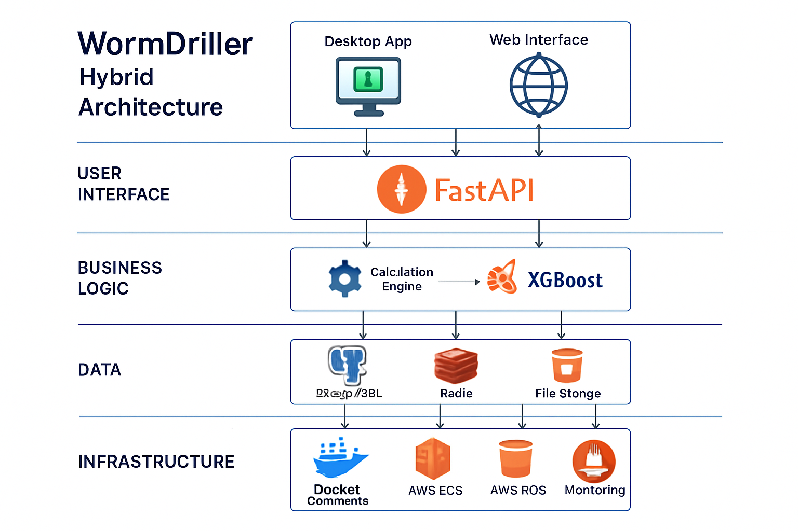

# WormDriller - Directional Drilling Solution

<div align="center">
  
  <br>
  <h3>The Complete Solution for Directional Drilling Professionals</h3>
  
  
  
  
  
</div>

Overview

WormDriller is a comprehensive software solution designed specifically for directional drilling professionals. This hybrid application combines advanced mathematical models with an intuitive interface to help you plan, monitor, and report on directional drilling operations with unprecedented efficiency and accuracy by utilizing the combining the power of modern cloud-native APIs with the familiarity of a robust desktop application.  


Key Features

Precise Trajectory Calculations
- Industry-Standard Calculations: Minimum curvature method with SPE/IADC compliance.
- Real-time Dogleg Analysis: Continuous wellbore quality monitoring.
- Anti-Collision Detection: Advanced proximity checks for multi-well operations.
- Build/Turn Rate Optimization: Automated parameter tuning for smooth trajectories.


Core Features

 Precision Directional Drilling
- Industry-Standard Calculations: Minimum curvature method with SPE/IADC compliance.
- Real-time Dogleg Analysis: Continuous wellbore quality monitoring.
- Anti-Collision Detection: Advanced proximity checks for multi-well operations.
- Build/Turn Rate Optimization: Automated parameter tuning for smooth trajectories.

 Machine Learning & Analytics
- ROP Prediction: XGBoost-powered rate of penetration forecasting.
- Formation Analysis: Automated lithology detection & parameter optimization.
- Performance Analytics: Historical data insights and trend recognition.
- Predictive Maintenance: Early warnings for equipment performance and potential failures.

 Advanced Visualization
- 3D Wellbore Visualization: Interactive trajectory plotting with live updates.
- Multi-Well Planning: Full field development visualization.
- Real-time Dashboards: Live drilling parameter monitoring and intelligent alerts.
- Custom Reporting: Auto-generated, industry-compliant reports in multiple formats.

 Integration & API
- RESTful API: OpenAPI 3.0 spec with interactive FastAPI docs.
- LAS File Processing: Automated well log ingestion and validation.
- Third-Party Compatibility: Integrates with major drilling software platforms.
- Real-time Streaming: WebSocket support for live telemetry feeds.
---
 Architecture Overview

The WormDriller Architecture consists of three main components working seamlessly:

Enhanced Desktop Application
   - Framework: PyQt6 with modern UI
   - Capabilities: Full directional workflows, project management, visualizations
   - Integration: Direct API communication with offline fallback
   - Field Performance: Lightweight, efficient for remote rig conditions
 FastAPI Service
   - Framework: FastAPI with auto-generated OpenAPI documentation
   - Capabilities: ML predictions, complex calculations, secure cloud endpoints
   - Scalability: Horizontal scaling, load balancing, caching
   - Security: JWT authentication, API key control, rate limiting
Integration Layer
   - Communication: REST + WebSocket for real-time updates
   - Data Sync: Automated sync between desktop & cloud
   - Offline Mode: Full feature fallback with graceful error handling
   - Robustness: Retry mechanisms for unstable connections

<div align="center">
  
</div>

---
 Installation & Quick Start
Prerequisites
- Python 3.8+
- 4GB RAM minimum
- ~25MB disk space
Run Locally
```bash
 Clone the repo
git clone https://github.com/BordelonDevOps/WormDriller.git
cd WormDriller
 Install dependencies (API + Desktop)
pip install -r wormdriller-api/requirements.txt
pip install -r wormdriller_desktop_hybrid/requirements.txt
 Run the API service
uvicorn wormdriller_api.app.enhanced_main:app --reload
 Run the Desktop app
python wormdriller_desktop_hybrid/main.py


## 📖 Documentation

Comprehensive documentation is available in the [docs](docs/) directory:

- [User Guide](docs/user_guide.md) - Complete guide to using the application
- [Mathematical Models](docs/math_models.md) - Details on implemented calculations
- [API Reference](docs/api_reference.md) - For developers extending the application
- [FAQ](docs/faq.md) - Frequently asked questions

## 🧪 Development

### Setting Up Development Environment

1. Clone the repository:
   ```bash
   git clone https://github.com/BordelonDevOps/WormDriller.git
   cd WormDriller
   ```

2. Create a virtual environment:
   ```bash
   python -m venv venv
   source venv/bin/activate  # On Windows: venv\Scripts\activate
   ```

3. Install development dependencies:
   ```bash
   pip install -r requirements-dev.txt
   ```

### Running Tests

```bash
python -m unittest discover tests
```

## 🤝 Contributing

Contributions are welcome! Please feel free to submit a Pull Request.

1. Fork the repository
2. Create your feature branch (`git checkout -b feature/amazing-feature`)
3. Commit your changes (`git commit -m 'Add some amazing feature'`)
4. Push to the branch (`git push origin feature/amazing-feature`)
5. Open a Pull Request

Please read [CONTRIBUTING.md](CONTRIBUTING.md) for details on our code of conduct and the process for submitting pull requests.

## 📄 License

This project is licensed under the MIT License - see the [LICENSE](LICENSE) file for details.

## 📞 Contact

- Email: Bordelondevops2025@gmail.com

## 🙏 Acknowledgments

Harold Bordelon’s legacy in the oilfields of South Louisiana and South Texas is a testament to his grit, expertise, and ability to transform struggling operations into profitable ventures. As a driller, company man, and mentor, he left an indelible mark on the industry, earning a reputation for turning around oilwells with a blend of hands-on skill, strategic insight, and a knack for inspiring those around him.

As a driller, Harold was the backbone of rig operations, overseeing the complex and high-stakes process of boring into the earth to extract oil. This role demanded technical precision, an intimate understanding of geology, and the ability to manage a crew under intense pressure. Oilwells often teetered on the edge of financial viability, and Harold’s ability to optimize drilling efficiency—whether by fine-tuning equipment, adjusting techniques, or navigating unforeseen challenges like equipment failures or tricky formations—set him apart. His reputation for taking wells that bled money and steering them to profitability likely stemmed from his sharp problem-solving and a dogged refusal to let obstacles derail progress. In South Louisiana and South Texas, where oilfields are as unforgiving as they are lucrative, Harold’s hands-on expertise made him a go-to figure for operators desperate to reverse their fortunes.

As a company man, Harold’s role expanded to represent the interests of the oil company on-site, acting as the critical link between the rig crew and corporate objectives. This position required a broader vision: he wasn’t just managing the drill bit but the entire operation, from budgeting and safety compliance to coordinating with geologists, engineers, and executives. His knack for turning losses into profits likely came from his ability to balance cost-cutting with operational excellence—knowing when to push a crew harder and when to invest in a smarter approach. The oilfields of the Gulf South are notorious for their high stakes, with millions of dollars riding on every well. Harold’s steady hand ensured that rigs under his watch didn’t just survive but thrived, delivering returns in an industry where margins can be razor-thin.

Perhaps most enduring was Harold’s role as a mentor. Over his 40-year career, he shaped countless young oilfield professionals who went on to become executives, engineers, and leaders in their own right. The oilfield is a crucible—long hours, harsh conditions, and constant pressure weed out the faint-hearted. Harold didn’t just teach technical skills; he modeled resilience, accountability, and the kind of practical wisdom that only comes from decades of experience. He likely had a no-nonsense style, tempered by a genuine investment in his mentees’ success. Stories from the field probably include late-night troubleshooting sessions, impromptu lessons on rig floors, and moments where he pushed a young roughneck or engineer to think bigger, work smarter, and own their decisions. His influence rippled beyond the wells he turned around, as his protégés carried his lessons into boardrooms and new ventures across the industry.

South Louisiana and South Texas oilfields, with their mix of onshore and offshore rigs, were Harold’s proving ground. These regions, rich in oil but fraught with challenges like volatile markets and complex reservoirs, demanded someone who could thrive in uncertainty. Harold Bordelon didn’t just meet that demand—he exceeded it, building a legacy as a driller who mastered the craft, a company man who delivered results, and a mentor whose impact endures in the careers he shaped. His story is one of sweat, ingenuity, and a quiet pride in seeing wells, and people, reach their potential.


